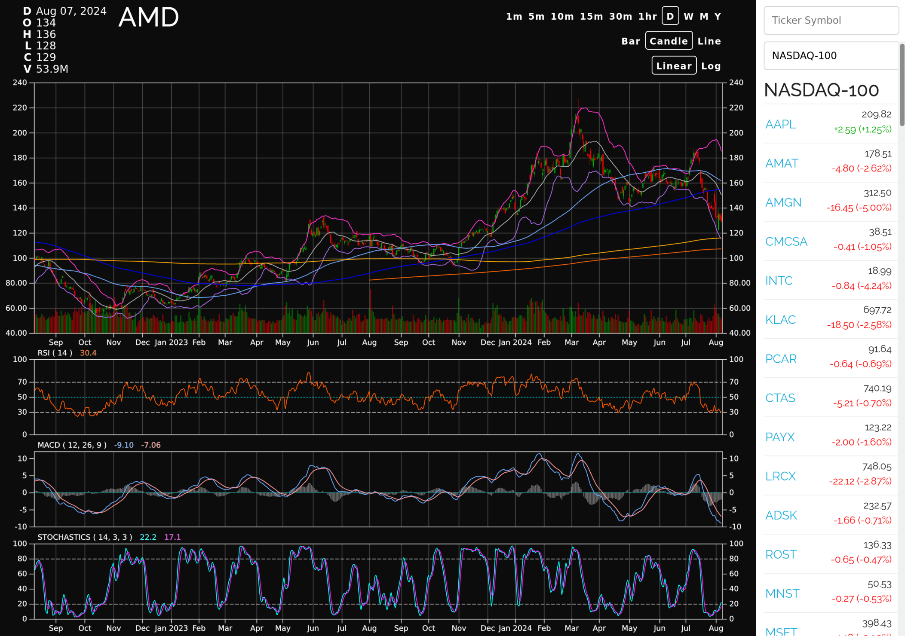

# Flask Techan Unchained

A financial charting and analysis app using Python/React. Built using [Flask Unchained](https://github.com/briancappello/flask-unchained) and [techan.js](http://techanjs.org/).



## Table of Contents

* [Development with Docker Compose](https://github.com/briancappello/flask-techan-unchained#development-with-docker-compose)
* [Running locally](https://github.com/briancappello/flask-techan-unchained#running-locally)
* [TODO](https://github.com/briancappello/flask-techan-unchained#todo)
* [License](https://github.com/briancappello/flask-techan-unchained#license)

## Development with Docker Compose

### Build containers

```shell
docker-compose up --build

# rootless PodMan with SELinux
podman-compose --podman-run-args="--replace --security-opt label=disable" up --build
```

### Run containers

```shell
docker-compose up

# rootless PodMan with SELinux
podman-compose --podman-run-args="--replace --security-opt label=disable" up
```

#### Initialize Financial Data

Only needed on the first run.

```shell
# connect to running backend container
docker exec -it fun_techan-backend_1 /bin/bash

# in container
poetry run flask finance init
poetry run fin init  # requires POLYGON_API_KEY envvar set on host
```

### View Charts

http://localhost:8888/finance/chart/AMD

* login with user `a@a.com` and password `password` (see `bundles/security/fixtures/User.yaml`)


## Running locally

This assumes you're on a reasonably standard \*nix system. (Tested on Linux)

Dependencies:

- Python 3.10+ and Poetry
- PostgreSQL
- Redis (used for auth sessions persistence and the Celery tasks queue)
- node.js v14 & npm v8
- MailHog (not required, but useful for testing email related tasks)

```bash
# install
git clone git@github.com:briancappello/flask-techan-unchained.git fun-techan
cd fun-techan
poetry install

# configure
edit `backend/config.py` as necessary
edit `frontend/app/config.js` as necessary

# set up database
sudo -u postgres -i psql
postgres=# CREATE USER fun_techan WITH SUPERUSER PASSWORD 'fun_techan';
postgres=# CREATE DATABASE fun_techan;
postgres=# GRANT ALL PRIVILEGES ON DATABASE fun_techan TO fun_techan;
postgres=# \q  # (quit)

# run db migrations
flask db upgrade

# load db fixtures (loads users & roles)
# modify bundles/security/fixtures/*.yaml
flask db import-fixtures

# initialize finance fixtures
flask finance init

# initialize daily historical data (requires POLYGON_API_KEY envvar)
fin init

# frontend dev server:
npm install

cd ..
git clone git@github.com:briancappello/techan.js.git
cd techan.js
sudo npm link
cd fun-techan
npm link techan

npm run build:dll
npm run start

# backend dev server:
flask run

# backend celery workers:
flask celery worker
```

## TODO

### Deployment

#### Deploying to Google Cloud with Kubernetes and Helm

See [gke/README.md](https://github.com/briancappello/flask-techan-unchained/blob/master/gke/README.md)

- convert marketstore PersistentVolumeClaim to StatefulSet (probably also want a ssd StorageClass)
- set up email & celery, ensure auth system works (registration/forgot password)
- convert k8s yaml files to Helm charts
- set up CI/CD
- consolidate and parametrize Helm charts so they work on both GKE and MiniKube
- improve development Dockerfiles to support editing code/configs without rebuilding images

### Missing App Features

- implement support for streaming data (realtime quotes)
- implement market overview page
- implement equity detail page
- implement indexes page
- implement index detail page
- implement watchlists page
- implement watchlist detail page
- add trading support (toggle-able between paper & live)
- add positions monitoring / account dashboards

### Frontend

- update to modern Webpack/Babel/React
- should probably convert chart to use [react-stockcharts](https://github.com/rrag/react-stockcharts)

## License

[Apache 2.0](https://github.com/briancappello/flask-techan-unchained/blob/master/LICENSE)
